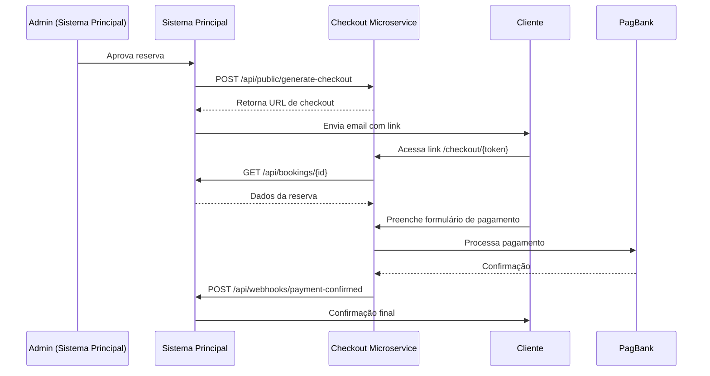

# Guia de Integração - Sistema Principal → Checkout Microservice

## 📍 Overview

Este microserviço foi projetado para ser **completamente independente** do sistema principal de reservas do Ibirahill, comunicando-se apenas por meio de APIs REST.

## 🔗 Fluxo de Integração



## 🛠️ Implementação no Sistema Principal

### 1. Gerar Link de Checkout (Após Aprovação)

Quando o admin aprovar uma reserva, o sistema deve gerar um link de checkout:

```typescript
// No AdminDashboard ou BookingRequestManager
async function handleApproveBooking(bookingId: string) {
  try {
    // Aprovar reserva no sistema atual
    await supabase
      .from('booking_requests')
      .update({ status: 'APPROVED' })
      .eq('id', bookingId);

    // Gerar checkout no microserviço
    const response = await fetch('https://checkout.ibirahill.com/api/public/generate-checkout', {
      method: 'POST',
      headers: {
        'Content-Type': 'application/json',
      },
      body: JSON.stringify({ bookingId }),
    });

    if (!response.ok) {
      throw new Error('Erro ao gerar checkout');
    }

    const data = await response.json();
    
    // data.checkoutUrl = "https://checkout.ibirahill.com/checkout/CHK-REQ-123-abc"
    // data.expiresAt = "2026-02-14T02:00:00.000Z"

    // Enviar email para cliente com o link
    await sendCheckoutEmail(bookingId, data.checkoutUrl, data.expiresAt);

    return data;
  } catch (error) {
    console.error('Erro ao gerar checkout:', error);
    throw error;
  }
}
```

### 2. Endpoint para Ler Dados da Reserva

O microserviço precisa ler os dados da reserva **já aprovada**. Criar este endpoint:

```typescript
// api/bookings/[id].ts ou similar

import { VercelRequest, VercelResponse } from '@vercel/node';
import { createClient } from '@supabase/supabase-js';

const supabase = createClient(
  process.env.SUPABASE_URL!,
  process.env.SUPABASE_SERVICE_KEY!
);

export default async function handler(req: VercelRequest, res: VercelResponse) {
  const { id } = req.query;

  if (req.method !== 'GET') {
    return res.status(405).json({ error: 'Method not allowed' });
  }

  try {
    const { data: booking, error } = await supabase
      .from('booking_requests')
      .select(`
        id,
        house_name,
        check_in,
        check_out,
        guests,
        total_price,
        status,
        guest_name,
        guest_email
      `)
      .eq('id', id)
      .single();

    if (error || !booking) {
      return res.status(404).json({ error: 'Reserva não encontrada' });
    }

    // Verificar se está aprovada
    if (booking.status !== 'APPROVED') {
      return res.status(400).json({ error: 'Reserva não está aprovada' });
    }

    return res.status(200).json(booking);
  } catch (error) {
    console.error('Error fetching booking:', error);
    return res.status(500).json({ error: 'Erro interno' });
  }
}
```

**URL esperada:** `https://ibirahill.com.br/api/bookings/{id}`

**Nota:** Se este endpoint já existir no `BookingRequestManager`, apenas confirme que retorna os campos necessários.

### 3. Webhook de Confirmação de Pagamento

Quando o pagamento for confirmado, o microserviço notificará o sistema principal:

```typescript
// api/webhooks/payment-confirmed.ts

import { VercelRequest, VercelResponse } from '@vercel/node';
import { createClient } from '@supabase/supabase-js';

const supabase = createClient(
  process.env.SUPABASE_URL!,
  process.env.SUPABASE_SERVICE_KEY!
);

export default async function handler(req: VercelRequest, res: VercelResponse) {
  if (req.method !== 'POST') {
    return res.status(405).json({ error: 'Method not allowed' });
  }

  try {
    const {
      bookingId,
      stayChargeId,
      depositChargeId,
      stayStatus,
      depositStatus,
      totalAmount,
      depositAmount,
    } = req.body;

    console.log('Pagamento confirmado:', {
      bookingId,
      stayChargeId,
      stayStatus,
      depositStatus,
    });

    // Atualizar status da reserva
    await supabase
      .from('booking_requests')
      .update({
        status: 'CONFIRMED',
        payment_status: 'PAID',
        stay_charge_id: stayChargeId,
        deposit_charge_id: depositChargeId,
        paid_at: new Date().toISOString(),
      })
      .eq('id', bookingId);

    // Enviar email de confirmação ao cliente
    await sendBookingConfirmedEmail(bookingId);

    // Outras ações (ex: adicionar ao calendário, gerar contrato, etc.)

    return res.status(200).json({ success: true });
  } catch (error) {
    console.error('Webhook error:', error);
    return res.status(500).json({ error: 'Erro ao processar webhook' });
  }
}
```

**URL esperada:** `https://ibirahill.com.br/api/webhooks/payment-confirmed`

### 4. (Opcional) Webhook de Checkout Expirado

Para notificar quando um checkout expira sem pagamento:

```typescript
// api/webhooks/checkout-expired.ts

export default async function handler(req: VercelRequest, res: VercelResponse) {
  if (req.method !== 'POST') {
    return res.status(405).json({ error: 'Method not allowed' });
  }

  const { bookingId, token, expiresAt } = req.body;

  // Opcional: atualizar status para "AWAITING_PAYMENT_EXPIRED"
  // Ou enviar email ao admin para tomar ação

  console.log(`Checkout expirado para reserva ${bookingId}`);

  return res.status(200).json({ success: true });
}
```

## 📧 Atualizar Email de Aprovação

Modificar o template de email que é enviado quando admin aprova:

```html
<!-- email-templates/approval.html -->

<h2>Sua reserva foi aprovada! 🎉</h2>

<p>Olá {{guest_name}},</p>

<p>
  Sua reserva na <strong>{{house_name}}</strong> foi aprovada pelo Ibirahill!
</p>

<div style="background: #f4ece1; padding: 20px; border-radius: 8px; margin: 20px 0;">
  <h3 style="margin-top: 0;">📅 Detalhes da Reserva</h3>
  <p><strong>Check-in:</strong> {{check_in}}</p>
  <p><strong>Check-out:</strong> {{check_out}}</p>
  <p><strong>Hóspedes:</strong> {{guests}}</p>
  <p><strong>Total:</strong> R$ {{total_price}}</p>
  <p><strong>Caução:</strong> R$ 1.000,00 (pré-autorização)</p>
</div>

<div style="background: #fff3cd; padding: 15px; border-left: 4px solid #ffc107; margin: 20px 0;">
  <h3 style="margin-top: 0;">💳 Finalizar Pagamento</h3>
  <p>
    Complete o pagamento em até 12 horas para confirmar sua reserva:
  </p>
  <p style="text-align: center; margin: 20px 0;">
    <a 
      href="{{checkout_url}}" 
      style="background: #233133; color: white; padding: 12px 32px; text-decoration: none; border-radius: 6px; display: inline-block; font-weight: bold;"
    >
      PAGAR AGORA
    </a>
  </p>
  <p style="font-size: 12px; color: #666;">
    ⏱️ Este link expira em: {{expires_at_formatted}}
  </p>
</div>

<p><strong>Sobre a Caução:</strong></p>
<ul>
  <li>R$ 1.000 serão pré-autorizados no seu cartão</li>
  <li>O valor NÃO será cobrado, apenas reservado</li>
  <li>Será liberado automaticamente após o checkout (sem danos)</li>
  <li>Em caso de danos, podemos capturar o valor</li>
</ul>

<p>
  Dúvidas? Responda este email ou contate: 
  <a href="mailto:contato@ibirahill.com.br">contato@ibirahill.com.br</a>
</p>
```

## 🔒 Segurança

### CORS
O microserviço já aceita requests de qualquer origem para APIs públicas. Se quiser restringir:

```typescript
// No microserviço: api/public/generate-checkout.ts
const allowedOrigins = [
  'https://ibirahill.com.br',
  'https://admin.ibirahill.com.br',
];

const origin = req.headers.origin;
if (allowedOrigins.includes(origin)) {
  res.setHeader('Access-Control-Allow-Origin', origin);
}
```

### Autenticação (Opcional)
Para maior segurança, pode adicionar um API key:

```typescript
// Sistema principal
const response = await fetch('https://checkout.ibirahill.com/api/public/generate-checkout', {
  headers: {
    'Content-Type': 'application/json',
    'X-API-Key': process.env.CHECKOUT_API_KEY,
  },
  // ...
});

// Microserviço
if (req.headers['x-api-key'] !== process.env.CHECKOUT_API_KEY) {
  return res.status(401).json({ error: 'Unauthorized' });
}
```

## 🧪 Testar Integração

### 1. Localmente (Desenvolvimento)

```bash
# Terminal 1: Sistema principal
cd "Sistema de reservas Ibirahill"
npm run dev  # porta 5173

# Terminal 2: Microserviço
cd checkout-microservice
npm run dev  # porta 3001
```

Atualizar `.env` do microserviço:
```
MAIN_APP_URL=http://localhost:5173
```

### 2. Testar Fluxo Completo

1. Criar uma reserva no sistema principal
2. Admin aprovar a reserva
3. Verificar se email foi enviado com link
4. Acessar link do checkout
5. Preencher formulário (usar cartão de teste)
6. Verificar se webhook foi recebido
7. Confirmar status mudou para "CONFIRMED"

### 3. Cartões de Teste PagBank

```
Aprovado:
  Número: 4111 1111 1111 1111
  CVV: 123
  Validade: 12/2030

Negado:
  Número: 4000 0000 0000 0002
  CVV: 123
  Validade: 12/2030
```

## 📋 Checklist de Integração

- [ ] Endpoint criado: `GET /api/bookings/{id}`
- [ ] Endpoint criado: `POST /api/webhooks/payment-confirmed`
- [ ] Endpoint criado (opcional): `POST /api/webhooks/checkout-expired`
- [ ] Função `handleApproveBooking` atualizada para gerar checkout
- [ ] Email de aprovação atualizado com link de checkout
- [ ] Campos adicionados ao banco (se necessário): `payment_status`, `stay_charge_id`, `deposit_charge_id`, `paid_at`
- [ ] Testado fluxo completo em desenvolvimento
- [ ] Variável de ambiente `MAIN_APP_URL` configurada no microserviço
- [ ] Variável de ambiente `CHECKOUT_BASE_URL` configurada (se usada no sistema principal)

## 🚀 Exemplo Completo de Integração

```typescript
// components/AdminDashboard.tsx (Sistema Principal)

async function handleApprove(request: BookingRequest) {
  setLoading(true);
  try {
    // 1. Aprovar reserva
    const { error: updateError } = await supabase
      .from('booking_requests')
      .update({ status: 'APPROVED' })
      .eq('id', request.id);

    if (updateError) throw updateError;

    // 2. Gerar checkout
    const checkoutResponse = await fetch(
      `${process.env.VITE_CHECKOUT_URL}/api/public/generate-checkout`,
      {
        method: 'POST',
        headers: { 'Content-Type': 'application/json' },
        body: JSON.stringify({ bookingId: request.id }),
      }
    );

    if (!checkoutResponse.ok) {
      throw new Error('Erro ao gerar checkout');
    }

    const { checkoutUrl, expiresAt } = await checkoutResponse.json();

    // 3. Enviar email de aprovação com link de checkout
    await fetch('/api/send-email', {
      method: 'POST',
      headers: { 'Content-Type': 'application/json' },
      body: JSON.stringify({
        to: request.guest_email,
        template: 'booking-approved',
        data: {
          guest_name: request.guest_name,
          house_name: request.house_name,
          check_in: format(new Date(request.check_in), 'dd/MM/yyyy'),
          check_out: format(new Date(request.check_out), 'dd/MM/yyyy'),
          guests: request.guests,
          total_price: request.total_price.toFixed(2),
          checkout_url: checkoutUrl,
          expires_at_formatted: format(new Date(expiresAt), "dd/MM/yyyy 'às' HH:mm"),
        },
      }),
    });

    setSuccess('Reserva aprovada e link de pagamento enviado!');
    refreshData();
  } catch (error) {
    console.error('Erro ao aprovar:', error);
    setError(error.message);
  } finally {
    setLoading(false);
  }
}
```

## 💡 Dicas

1. **Logs**: Use `console.log` generosamente durante desenvolvimento para rastrear fluxo
2. **Timeout**: Checkout expira em 12h, cliente tem tempo suficiente
3. **Re-gerar**: Se expirar, admin pode re-aprovar para gerar novo link
4. **Webhooks Async**: Não espere resposta do webhook do sistema principal, processar em background
5. **Idempotência**: Se receber mesmo webhook 2x, não deve duplicar dados

---

**Pronto para integrar!** 🚀

Qualquer dúvida, consulte o [README.md](./README.md) principal.
